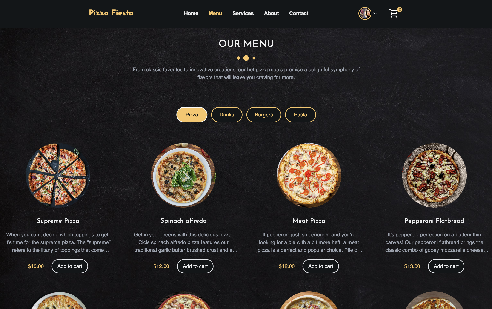
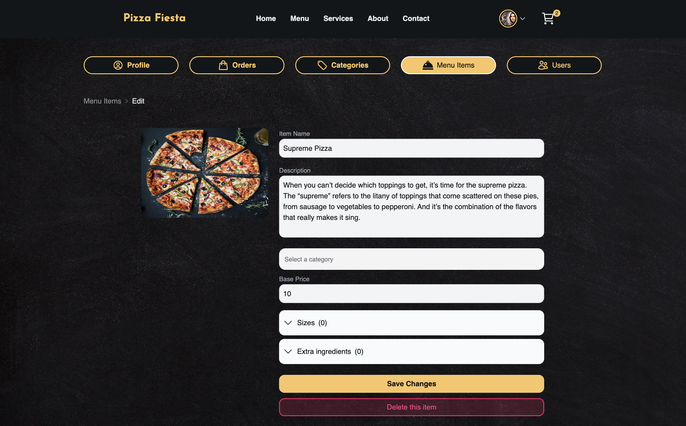

# Pizza Fiesta Website 
View a demo of this app [here](https://pizza-fiesta.vercel.app/).<br><br>
# pizza-shop-react

This is a fullstack food ordering app built with Next.js 14 (React.js, MongoDB, Tailwind CSS).
<br>

<p align="center">
Home page
</p>


<p align="center">
Menu page
</p>



<p align="center">
Admin Dashboard
</p>



## Features
- User authentication with NextAuth (Email & Google)
- Customizable user profiles
- User-friendly order placement
- Stripe integration for payment processing
- Admin dashboard for restaurant, user, and order management
- EmailJS integration for customer support
- Cloudinary integration for image processing and storage
- Database handling with MongoDB
- UI design with Tailwind CSS & NextUI

## Getting Started


# 🍕 Pizza Fiesta Website

This is a fullstack food ordering app built with **Next.js 14**, **MongoDB**, and **Tailwind CSS**.

<p align="center">
  <strong>Home page</strong><br>
  
</p>

<p align="center">
  <strong>Menu page</strong><br>
  
</p>

<p align="center">
  <strong>Admin Dashboard</strong><br>
  
</p>

---

## ✨ Features

- User authentication with NextAuth (Email & Google)
- Customizable user profiles
- User-friendly order placement
- Stripe integration for payment processing
- Admin dashboard for restaurant, user, and order management
- EmailJS integration for customer support
- Cloudinary integration for image processing and storage
- Database handling with MongoDB
- UI design with Tailwind CSS & NextUI

---

## 🔧 Getting Started (Run Locally)

Follow these steps to clone and run Pizza Fiesta on your local machine:

### 1️⃣ Clone the Repository

```bash
git clone https://github.com/your-username/pizza-fiesta.git
cd pizza-fiesta

npm install

touch .env.local

MONGODB_URI=mongodb+srv://<username>:<password>@cluster0.mongodb.net/<dbname>?retryWrites=true&w=majority
NEXTAUTH_URL=http://localhost:3000
NEXTAUTH_SECRET=your_random_secret

CLOUDINARY_CLOUD_NAME=your_cloud_name
CLOUDINARY_API_KEY=your_api_key
CLOUDINARY_API_SECRET=your_api_secret

STRIPE_SECRET_KEY=your_stripe_secret_key
STRIPE_WEBHOOK_SECRET=your_stripe_webhook_secret

EMAILJS_USER_ID=your_emailjs_user_id
EMAILJS_SERVICE_ID=your_emailjs_service_id
EMAILJS_TEMPLATE_ID=your_emailjs_template_id

openssl rand -base64 32

npm run dev
```